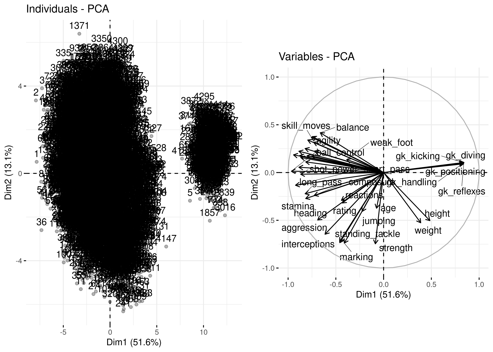

```{r setup, include=FALSE}
knitr::opts_chunk$set(echo = TRUE)
library(dplyr)
```
# 1. Classificador

## Problema 

Temos um problema de classificação multiclasse. Como cada jogador tem mais de uma classificação considerada correta, uma abordagem possível é utilizando modelos _multilabel_, que pode atribuir um ou mais rótulos não-exclusivos para uma mesma observação. 

Porém, para simplificar o problema, optamos por tratá-lo apenas como um classificador multiclasse, que atribui dentre as N classes disponíveis, um único rótulo. Para não perder a informação de que mais de uma posição pode estar correta, treinamos o modelo no formato longo e para a predição final, agrupamos por jogador a de maior probabilidade.

### Função de risco

$$
R(g) :=  \mathbb{E}[\mathbb{I}(Y \neq g(\boldsymbol{X}))] = \mathbb{P}(Y \neq g(\boldsymbol{X}))
$$

Adotamos a função de perda 0-1, comum para problemas de classificação, mas não a única.

### Data splitting 

O conjunto de dados de treino foi separado em treino e validação, para estimar $\hat{R}(g)$.

## Análise exploratória

## Modelos 

Foram treinados 5 modelos distintos:

- Regressão multinomial ou _softmax_
- Naive Bayes
- Support Vector Machines
- Árvores de decisão
- Random Forest

O método que forneceu o melhor resultado foi o Random Forest, de acordo com o risco estimado na tabela a seguir.

```{r echo=FALSE}

read.csv("artifacts/loss-models.csv") |> 
  mutate(Modelo =
           case_when(
             Modelo == "Y_val_nb" ~ "Naive Bayes",
             Modelo == "Y_val_svm" ~ "SVM",
             Modelo == "Y_val" ~ "Regressão multinomial",
             Modelo == "Y_val_tree" ~ "Árvorede de decisão",
             Modelo == "Y_val_rf" ~ "Random Forest"
           )
  ) |> 
  knitr::kable( booktabs = TRUE, col.names = c("Modelo", "Risco estimado"))

```

## Redução de dimensionalidade

Aplicamos a técnica de análise de componente principal (PCA) para redução de dimensionalidade das covariáveis numéricas e há claramente um agrupamento nos dados. Observa-se no gráfico abaixo os primeiros dois componentes, com as observações individuais e a correlação entre as variáveis.




## Comentários

# 2. Recomendador